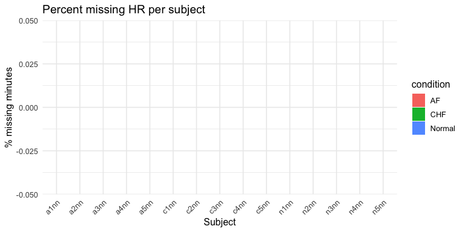
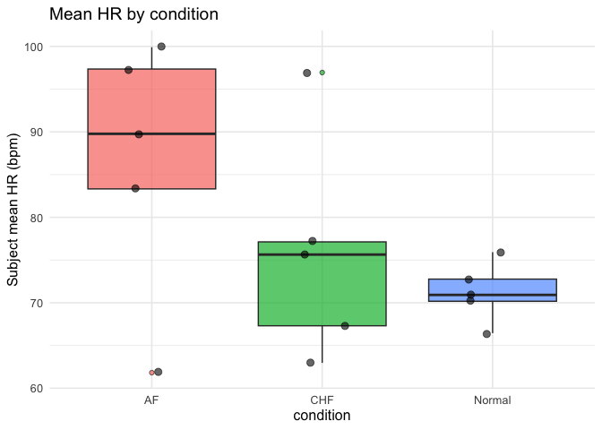
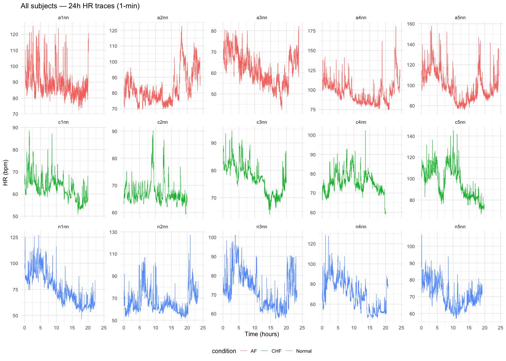
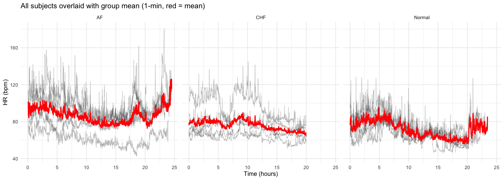
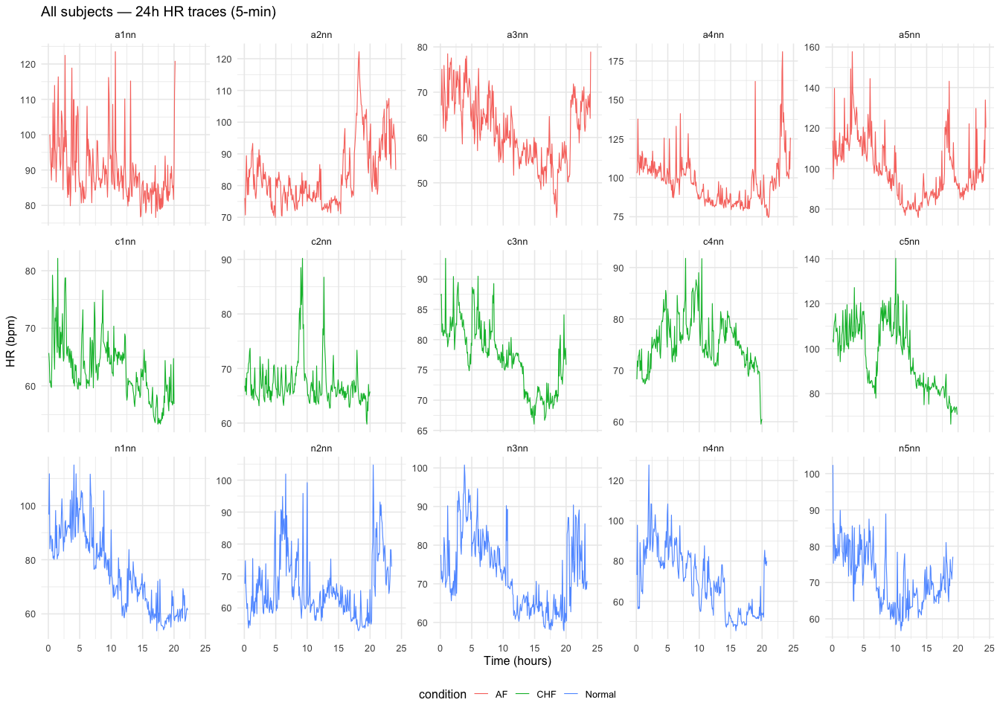
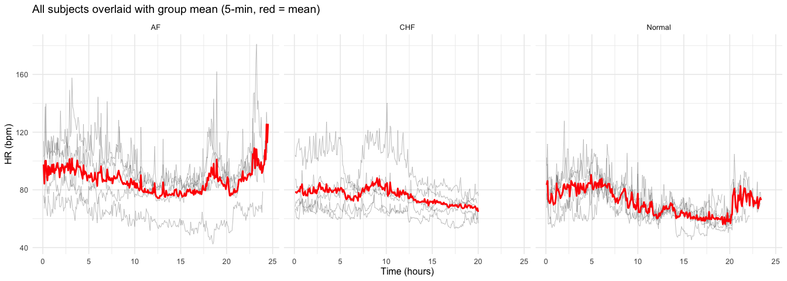
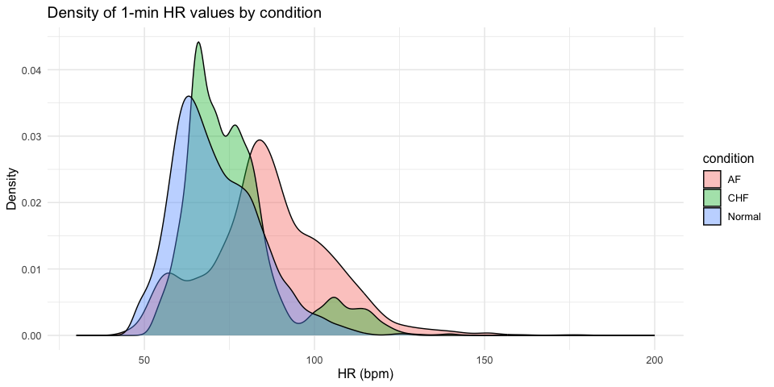
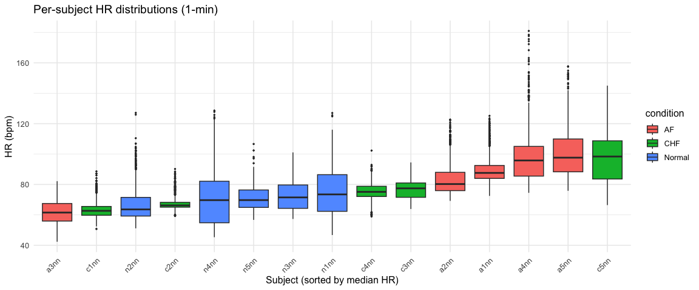

# EDA: PhysioNet CHAOS HR Time Series

2026-02-27

- [1 Setup & Data Loading](#1-setup--data-loading)
- [2 Subject-Level Summary](#2-subject-level-summary)
  - [Counts by Condition](#counts-by-condition)
  - [Subject Inventory](#subject-inventory)
  - [Recording Duration](#recording-duration)
- [3 Missing Data Audit](#3-missing-data-audit)
- [4 Descriptive Statistics](#4-descriptive-statistics)
  - [Overall](#overall)
  - [Per-Subject](#per-subject)
  - [By Condition](#by-condition)
  - [Sanity Checks](#sanity-checks)
- [5 HR Time Series Plots (1-min)](#5-hr-time-series-plots-1-min)
  - [All Individual Traces](#all-individual-traces)
  - [Spaghetti Plots by Condition](#spaghetti-plots-by-condition)
- [6 HR Time Series Plots (5-min)](#6-hr-time-series-plots-5-min)
  - [All Individual Traces](#all-individual-traces-1)
  - [Spaghetti Plots by Condition](#spaghetti-plots-by-condition-1)
- [7 Distribution Plots](#7-distribution-plots)
  - [Density of All HR Values (1-min)](#density-of-all-hr-values-1-min)
  - [Per-Subject Boxplots](#per-subject-boxplots)

## 1 Setup & Data Loading

    --- 1-minute data ---

    Dimensions: 19537 rows x 11 cols

    Subjects: 15 

    Conditions: AF, CHF, Normal 

    --- 5-minute data ---

    Dimensions: 3905 rows x 12 cols

    Subjects: 15 

    Rows: 19,537
    Columns: 11
    $ id               <chr> "a1nn", "a1nn", "a1nn", "a1nn", "a1nn", "a1nn", "a1nn…
    $ condition        <chr> "AF", "AF", "AF", "AF", "AF", "AF", "AF", "AF", "AF",…
    $ sex              <chr> NA, NA, NA, NA, NA, NA, NA, NA, NA, NA, NA, NA, NA, N…
    $ age              <dbl> NA, NA, NA, NA, NA, NA, NA, NA, NA, NA, NA, NA, NA, N…
    $ source_record    <chr> "ltafdb/11", "ltafdb/11", "ltafdb/11", "ltafdb/11", "…
    $ minute_index     <dbl> 12, 13, 14, 15, 16, 17, 18, 19, 20, 21, 22, 23, 24, 2…
    $ mean_hr          <dbl> 110.33859, 95.44773, 99.37039, 100.02294, 95.97645, 8…
    $ sdnn             <dbl> 0.1684258, 0.1565922, 0.1736779, 0.1799429, 0.1847734…
    $ rmssd            <dbl> 0.1961302, 0.2019624, 0.2364009, 0.2008872, 0.2294581…
    $ n_beats          <dbl> 100, 90, 93, 93, 88, 84, 84, 83, 85, 83, 89, 90, 80, …
    $ minute_start_sec <dbl> 660, 720, 780, 840, 900, 960, 1020, 1080, 1140, 1200,…

## 2 Subject-Level Summary

### Counts by Condition

| condition | n_subjects |
|:----------|-----------:|
| AF        |          5 |
| CHF       |          5 |
| Normal    |          5 |

Subjects by condition

### Subject Inventory

| id   | condition | source_record |
|:-----|:----------|:--------------|
| a1nn | AF        | ltafdb/11     |
| a2nn | AF        | ltafdb/12     |
| a3nn | AF        | ltafdb/15     |
| a4nn | AF        | ltafdb/17     |
| a5nn | AF        | ltafdb/18     |
| c1nn | CHF       | chfdb/chf01   |
| c2nn | CHF       | chfdb/chf03   |
| c3nn | CHF       | chfdb/chf07   |
| c4nn | CHF       | chfdb/chf08   |
| c5nn | CHF       | chfdb/chf12   |
| n1nn | Normal    | nsrdb/16265   |
| n2nn | Normal    | nsrdb/16272   |
| n3nn | Normal    | nsrdb/16786   |
| n4nn | Normal    | nsrdb/16795   |
| n5nn | Normal    | nsrdb/19090   |

All subjects with source records

### Recording Duration

| condition | n_subjects | median_minutes | min_minutes | max_minutes | median_valid_min |
|:----------|-----------:|---------------:|------------:|------------:|-----------------:|
| AF        |          5 |           1445 |        1199 |        1470 |             1445 |
| CHF       |          5 |           1200 |        1190 |        1200 |             1200 |
| Normal    |          5 |           1332 |        1153 |        1404 |             1332 |

Recording duration by condition

| id   | condition | n_minutes | n_valid_min | duration_hr |
|:-----|:----------|----------:|------------:|------------:|
| a1nn | AF        |      1199 |        1199 |        20.0 |
| a2nn | AF        |      1445 |        1445 |        24.1 |
| a3nn | AF        |      1432 |        1432 |        23.9 |
| a4nn | AF        |      1470 |        1470 |        24.5 |
| a5nn | AF        |      1467 |        1467 |        24.4 |
| c1nn | CHF       |      1200 |        1200 |        20.0 |
| c2nn | CHF       |      1200 |        1200 |        20.0 |
| c3nn | CHF       |      1200 |        1200 |        20.0 |
| c4nn | CHF       |      1200 |        1200 |        20.0 |
| c5nn | CHF       |      1190 |        1190 |        19.8 |
| n1nn | Normal    |      1332 |        1332 |        22.2 |
| n2nn | Normal    |      1404 |        1404 |        23.4 |
| n3nn | Normal    |      1400 |        1400 |        23.3 |
| n4nn | Normal    |      1245 |        1245 |        20.8 |
| n5nn | Normal    |      1153 |        1153 |        19.2 |

Per-subject recording duration

## 3 Missing Data Audit

| subjects_any_missing | subjects_gt5pct | subjects_gt20pct | median_pct_missing | max_pct_missing |
|---:|---:|---:|---:|---:|
| 0 | 0 | 0 | 0 | 0 |

Missing data summary (mean_hr NAs)

## 4 Descriptive Statistics

### Overall

| n_obs | mean_hr | sd_hr | median_hr | iqr_hr | min_hr | max_hr |
|------:|--------:|------:|----------:|-------:|-------:|-------:|
| 19537 |    78.1 |    NA |      78.1 |      0 |   78.1 |   78.1 |

Overall HR descriptive statistics (1-min)

### Per-Subject

| id   | condition | mean_hr | sd_hr | min_hr | max_hr | n_valid |
|:-----|:----------|--------:|------:|-------:|-------:|--------:|
| a1nn | AF        |    89.8 |    NA |   89.8 |   89.8 |    1199 |
| a2nn | AF        |    83.3 |    NA |   83.3 |   83.3 |    1445 |
| a3nn | AF        |    61.8 |    NA |   61.8 |   61.8 |    1432 |
| a4nn | AF        |    97.4 |    NA |   97.4 |   97.4 |    1470 |
| a5nn | AF        |    99.9 |    NA |   99.9 |   99.9 |    1467 |
| c1nn | CHF       |    63.0 |    NA |   63.0 |   63.0 |    1200 |
| c2nn | CHF       |    67.3 |    NA |   67.3 |   67.3 |    1200 |
| c3nn | CHF       |    77.1 |    NA |   77.1 |   77.1 |    1200 |
| c4nn | CHF       |    75.6 |    NA |   75.6 |   75.6 |    1200 |
| c5nn | CHF       |    96.9 |    NA |   96.9 |   96.9 |    1190 |
| n1nn | Normal    |    75.9 |    NA |   75.9 |   75.9 |    1332 |
| n2nn | Normal    |    66.4 |    NA |   66.4 |   66.4 |    1404 |
| n3nn | Normal    |    72.8 |    NA |   72.8 |   72.8 |    1400 |
| n4nn | Normal    |    70.2 |    NA |   70.2 |   70.2 |    1245 |
| n5nn | Normal    |    70.9 |    NA |   70.9 |   70.9 |    1153 |

Per-subject HR statistics

### By Condition

### Sanity Checks

    Subjects with mean HR outside [40, 150] bpm: 0 

    Subjects with <12 hours valid data: 0 

    Individual minutes with HR outside [20, 250] bpm: 0 

## 5 HR Time Series Plots (1-min)

### All Individual Traces

With only 15 subjects we can show every trace individually.

### Spaghetti Plots by Condition

## 6 HR Time Series Plots (5-min)

### All Individual Traces

### Spaghetti Plots by Condition

## 7 Distribution Plots

### Density of All HR Values (1-min)

### Per-Subject Boxplots

