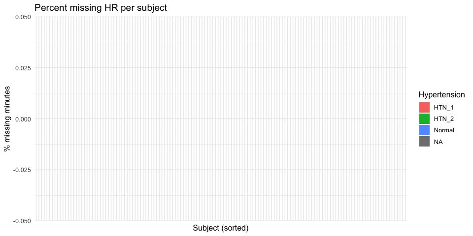
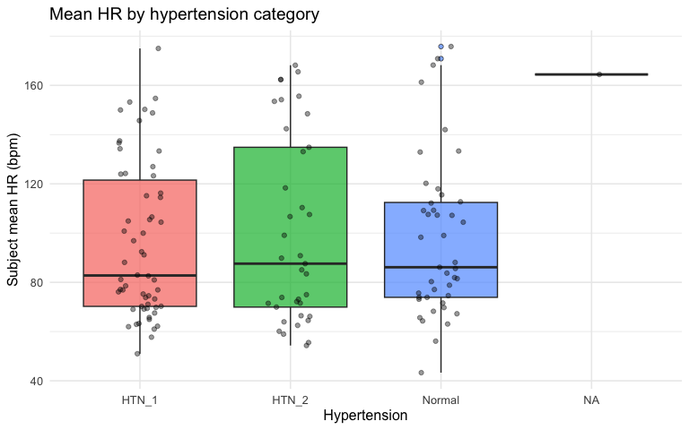
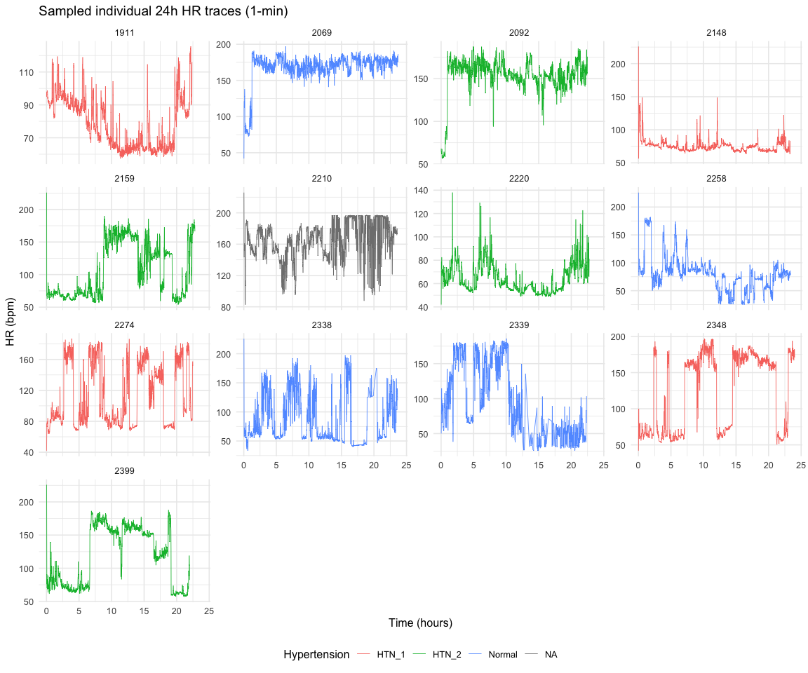
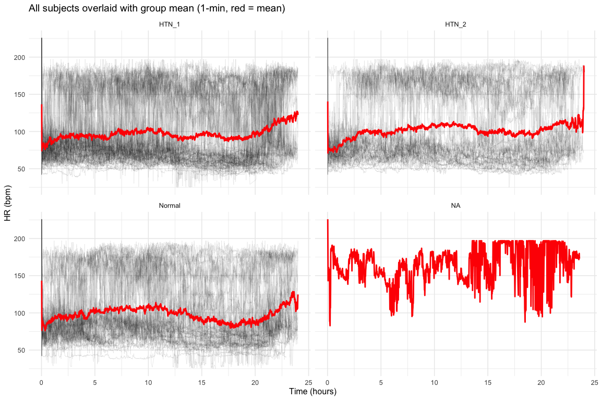
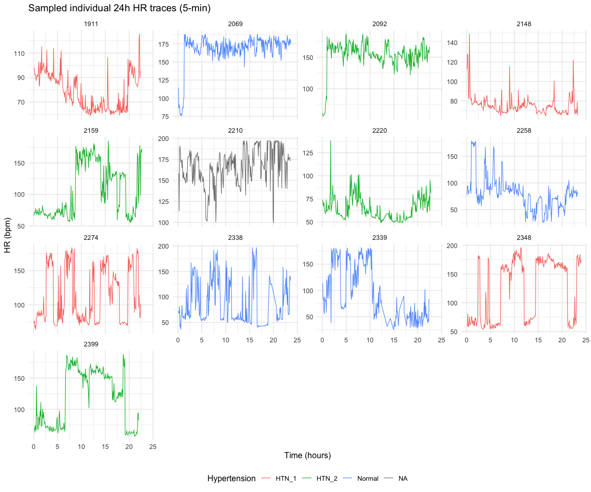
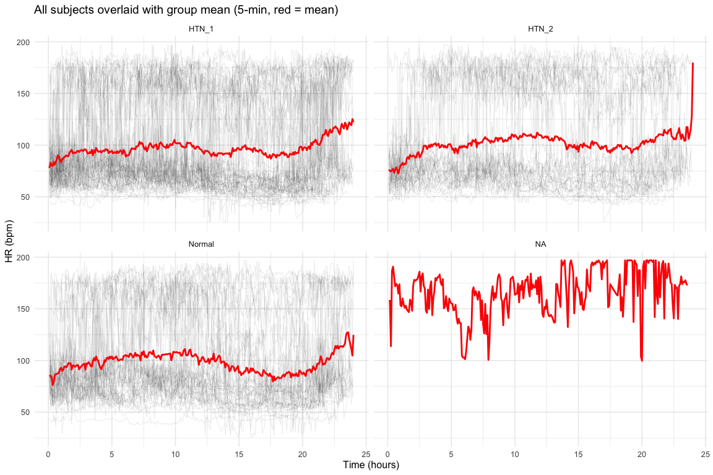
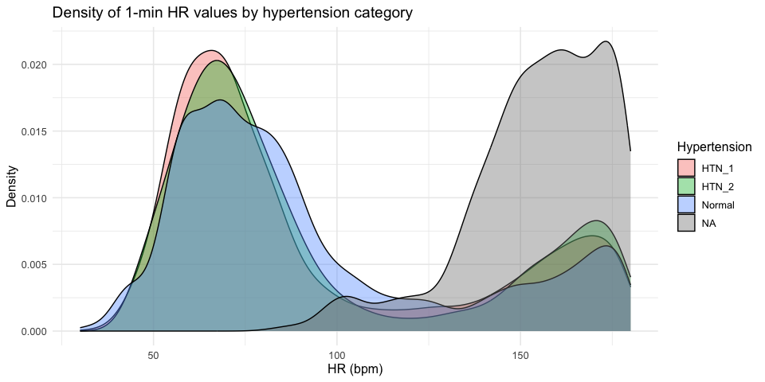
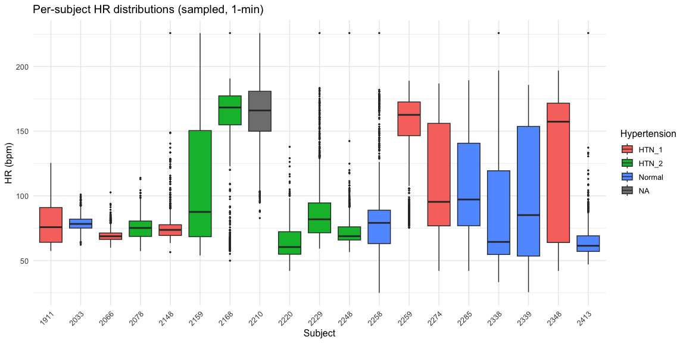
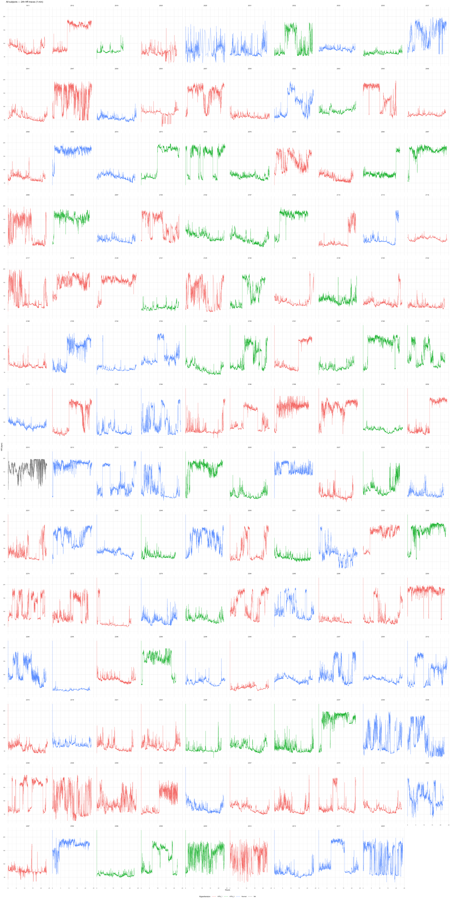

# EDA: SHAREE HR Time Series

2026-02-27

- [1 Setup & Data Loading](#1-setup--data-loading)
- [2 Subject-Level Summary](#2-subject-level-summary)
  - [Demographics](#demographics)
  - [Counts by Hypertension Category](#counts-by-hypertension-category)
  - [Recording Duration](#recording-duration)
- [3 Missing Data Audit](#3-missing-data-audit)
- [4 Descriptive Statistics](#4-descriptive-statistics)
  - [Overall](#overall)
  - [Per-Subject](#per-subject)
  - [By Hypertension Category](#by-hypertension-category)
  - [Sanity Checks](#sanity-checks)
- [5 HR Time Series Plots (1-min)](#5-hr-time-series-plots-1-min)
  - [Individual Traces (Sampled)](#individual-traces-sampled)
  - [Spaghetti Plots by Group](#spaghetti-plots-by-group)
- [6 HR Time Series Plots (5-min)](#6-hr-time-series-plots-5-min)
  - [Individual Traces (Sampled)](#individual-traces-sampled-1)
  - [Spaghetti Plots by Group](#spaghetti-plots-by-group-1)
- [7 Distribution Plots](#7-distribution-plots)
  - [Density of All HR Values (1-min)](#density-of-all-hr-values-1-min)
  - [Per-Subject Boxplots (Sampled)](#per-subject-boxplots-sampled)
- [8 Full Subject Gallery](#8-full-subject-gallery)

## 1 Setup & Data Loading

    --- 1-minute data ---

    Dimensions: 187510 rows x 25 cols

    Subjects: 139 

    --- 5-minute data ---

    Dimensions: 37461 rows x 26 cols

    Subjects: 139 

    Rows: 187,510
    Columns: 25
    $ id               <dbl> 1911, 1911, 1911, 1911, 1911, 1911, 1911, 1911, 1911,…
    $ Gender           <chr> "M", "M", "M", "M", "M", "M", "M", "M", "M", "M", "M"…
    $ Age              <dbl> 56, 56, 56, 56, 56, 56, 56, 56, 56, 56, 56, 56, 56, 5…
    $ Weight           <dbl> 105, 105, 105, 105, 105, 105, 105, 105, 105, 105, 105…
    $ Height           <dbl> 180, 180, 180, 180, 180, 180, 180, 180, 180, 180, 180…
    $ BSA              <dbl> 2.29, 2.29, 2.29, 2.29, 2.29, 2.29, 2.29, 2.29, 2.29,…
    $ BMI              <dbl> 32.41, 32.41, 32.41, 32.41, 32.41, 32.41, 32.41, 32.4…
    $ Smoker           <chr> "yes", "yes", "yes", "yes", "yes", "yes", "yes", "yes…
    $ SBP              <dbl> 140, 140, 140, 140, 140, 140, 140, 140, 140, 140, 140…
    $ DBP              <dbl> 80, 80, 80, 80, 80, 80, 80, 80, 80, 80, 80, 80, 80, 8…
    $ `IMT MAX`        <dbl> 4, 4, 4, 4, 4, 4, 4, 4, 4, 4, 4, 4, 4, 4, 4, 4, 4, 4,…
    $ LVMi             <dbl> 123, 123, 123, 123, 123, 123, 123, 123, 123, 123, 123…
    $ EF               <dbl> 66, 66, 66, 66, 66, 66, 66, 66, 66, 66, 66, 66, 66, 6…
    $ `Vascular event` <chr> "none", "none", "none", "none", "none", "none", "none…
    $ HTN              <chr> "HTN_1", "HTN_1", "HTN_1", "HTN_1", "HTN_1", "HTN_1",…
    $ Hypertension     <chr> "HTN_1", "HTN_1", "HTN_1", "HTN_1", "HTN_1", "HTN_1",…
    $ vascular_event   <chr> "none", "none", "none", "none", "none", "none", "none…
    $ minute_index     <dbl> 1, 2, 3, 4, 5, 6, 7, 8, 9, 10, 11, 12, 13, 14, 15, 16…
    $ mean_hr          <dbl> 97.94208, 94.92855, 95.97898, 97.06407, 98.09142, 98.…
    $ mean_hr_ibi60    <dbl> 97.94208, 94.92855, 95.97898, 97.06407, 98.09142, 98.…
    $ sdnn             <dbl> 0.014973884, 0.013132801, 0.018752284, 0.014249356, 0…
    $ rmssd            <dbl> 0.015050655, 0.012140569, 0.017432465, 0.013787642, 0…
    $ n_beats          <dbl> 98, 95, 96, 97, 98, 99, 96, 97, 98, 96, 94, 93, 95, 9…
    $ minute_start_sec <dbl> 0, 60, 120, 180, 240, 300, 360, 420, 480, 540, 600, 6…
    $ record_id        <dbl> 1911, 1911, 1911, 1911, 1911, 1911, 1911, 1911, 1911,…

## 2 Subject-Level Summary

### Demographics

|   n | age_mean | age_sd | bmi_mean | bmi_sd | pct_male | pct_smoker |
|----:|---------:|-------:|---------:|-------:|---------:|-----------:|
| 139 |     71.8 |    6.9 |     27.7 |      4 |       64 |       28.8 |

Overall demographics

### Counts by Hypertension Category

| Hypertension | n_subjects |
|:-------------|-----------:|
| HTN_1        |         58 |
| HTN_2        |         37 |
| Normal       |         43 |
| NA           |          1 |

Subjects by hypertension category

### Recording Duration

| n_subjects | median_minutes | min_minutes | max_minutes | median_valid_min |
|-----------:|---------------:|------------:|------------:|-----------------:|
|        139 |           1367 |         932 |        1440 |             1367 |

Recording duration summary

## 3 Missing Data Audit

| subjects_any_missing | subjects_gt5pct | subjects_gt20pct | median_pct_missing | max_pct_missing |
|---:|---:|---:|---:|---:|
| 0 | 0 | 0 | 0 | 0 |

Missing data summary (mean_hr NAs)

## 4 Descriptive Statistics

### Overall

|  n_obs | mean_hr | sd_hr | median_hr | iqr_hr | min_hr | max_hr |
|-------:|--------:|------:|----------:|-------:|-------:|-------:|
| 187510 |    98.1 |    NA |      98.1 |      0 |   98.1 |   98.1 |

Overall HR descriptive statistics (1-min)

### Per-Subject

|   id | Hypertension | mean_hr | sd_hr | min_hr | max_hr | n_valid |
|-----:|:-------------|--------:|------:|-------:|-------:|--------:|
| 1911 | HTN_1        |    78.6 |    NA |   78.6 |   78.6 |    1342 |
| 2012 | HTN_1        |   134.3 |    NA |  134.3 |  134.3 |    1426 |
| 2019 | HTN_2        |    71.5 |    NA |   71.5 |   71.5 |     959 |
| 2020 | HTN_1        |    67.5 |    NA |   67.5 |   67.5 |    1106 |
| 2025 | Normal       |    75.6 |    NA |   75.6 |   75.6 |     932 |
| 2031 | Normal       |    69.7 |    NA |   69.7 |   69.7 |    1346 |
| 2032 | HTN_2        |    99.1 |    NA |   99.1 |   99.1 |    1349 |
| 2033 | Normal       |    78.8 |    NA |   78.8 |   78.8 |    1324 |
| 2035 | HTN_2        |    64.0 |    NA |   64.0 |   64.0 |    1433 |
| 2037 | Normal       |   132.9 |    NA |  132.9 |  132.9 |    1122 |
| 2041 | HTN_1        |    61.0 |    NA |   61.0 |   61.0 |    1430 |
| 2047 | HTN_1        |   136.6 |    NA |  136.6 |  136.6 |    1347 |
| 2050 | Normal       |    56.1 |    NA |   56.1 |   56.1 |    1438 |
| 2055 | HTN_1        |    77.1 |    NA |   77.1 |   77.1 |    1251 |
| 2057 | HTN_1        |   145.7 |    NA |  145.7 |  145.7 |    1407 |
| 2059 | HTN_1        |    62.9 |    NA |   62.9 |   62.9 |    1438 |
| 2062 | Normal       |   104.4 |    NA |  104.4 |  104.4 |    1423 |
| 2063 | HTN_2        |    83.4 |    NA |   83.4 |   83.4 |    1355 |
| 2065 | HTN_1        |   137.4 |    NA |  137.4 |  137.4 |    1212 |
| 2066 | HTN_1        |    69.4 |    NA |   69.4 |   69.4 |    1390 |

Per-subject stats (first 20)

### By Hypertension Category

### Sanity Checks

    Subjects with mean HR outside [40, 150] bpm: 17 

    Subjects with <12 hours valid data: 0 

    Individual minutes with HR outside [20, 250] bpm: 0 

    Flagged subjects (mean HR):

|   id | Hypertension | mean_hr |
|-----:|:-------------|--------:|
| 2069 | Normal       |   168.2 |
| 2087 | HTN_2        |   168.2 |
| 2092 | HTN_2        |   153.5 |
| 2108 | HTN_2        |   155.6 |
| 2119 | HTN_1        |   150.0 |
| 2168 | HTN_2        |   154.2 |
| 2188 | HTN_1        |   153.2 |
| 2191 | HTN_1        |   154.7 |
| 2210 | NA           |   164.4 |
| 2213 | Normal       |   175.8 |
| 2219 | HTN_2        |   162.4 |
| 2226 | Normal       |   161.3 |
| 2259 | HTN_1        |   150.2 |
| 2269 | HTN_2        |   162.3 |
| 2293 | HTN_1        |   175.0 |
| 2337 | HTN_2        |   165.5 |
| 2392 | Normal       |   170.8 |

## 5 HR Time Series Plots (1-min)

### Individual Traces (Sampled)

### Spaghetti Plots by Group

## 6 HR Time Series Plots (5-min)

### Individual Traces (Sampled)

### Spaghetti Plots by Group

## 7 Distribution Plots

### Density of All HR Values (1-min)

### Per-Subject Boxplots (Sampled)

## 8 Full Subject Gallery

Every subject’s 1-min HR trace, faceted by ID and colored by
hypertension category.

