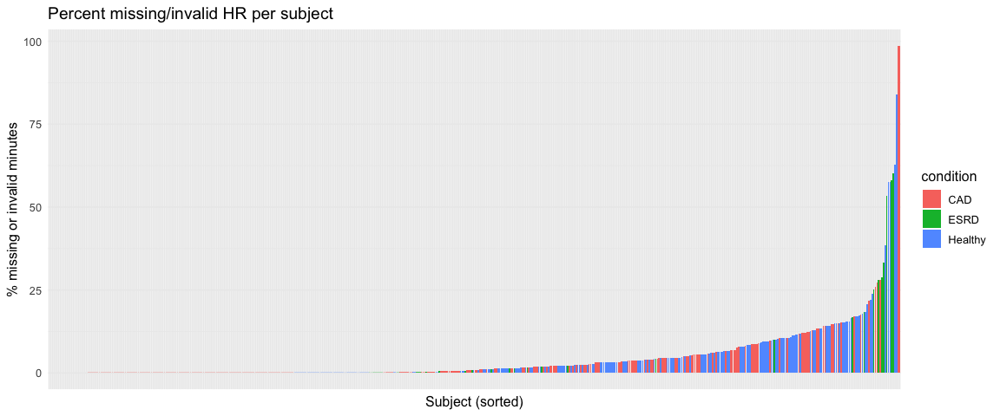
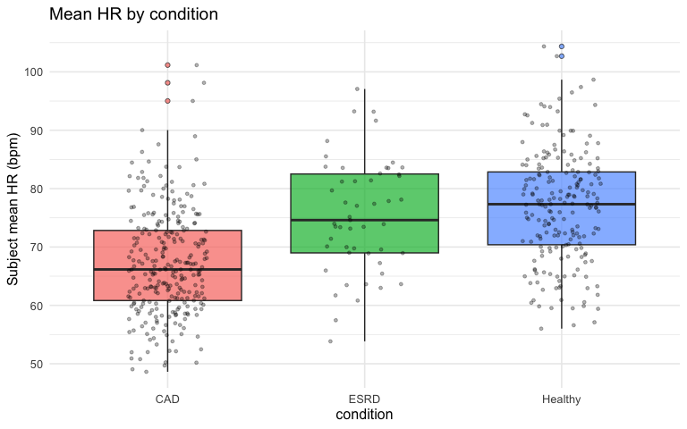
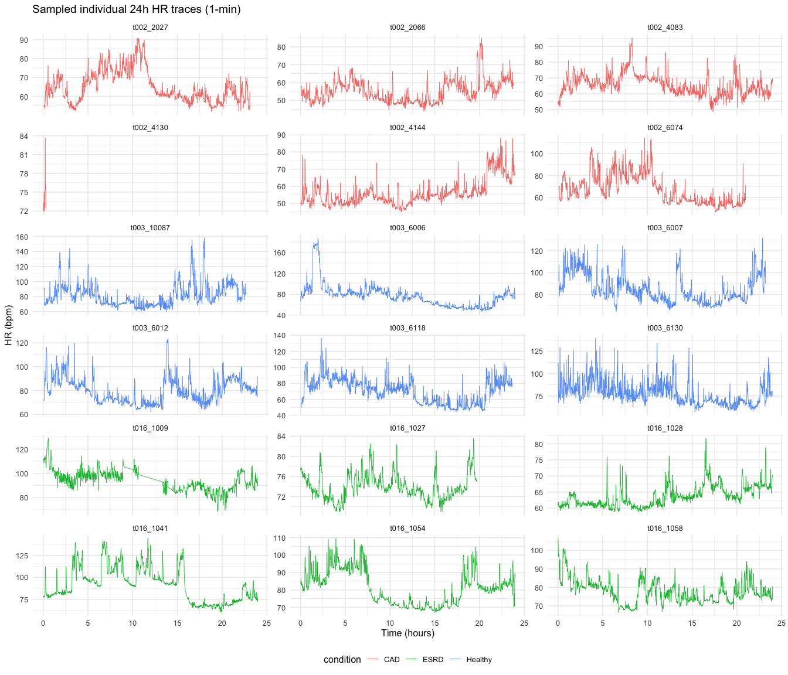
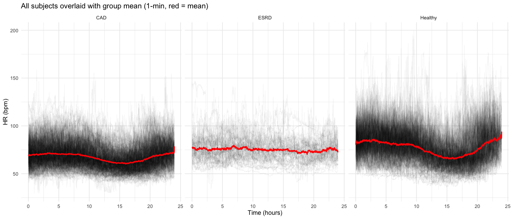
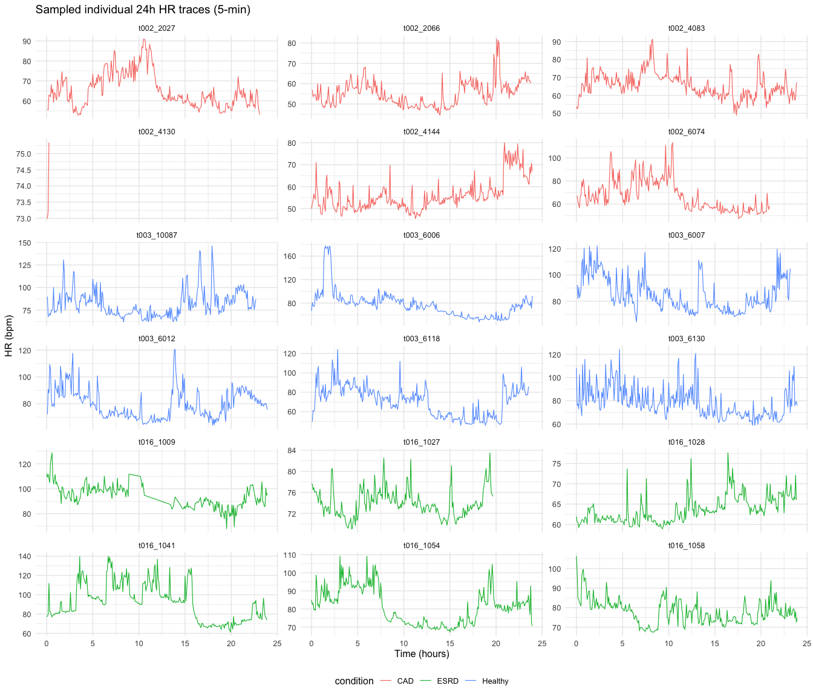
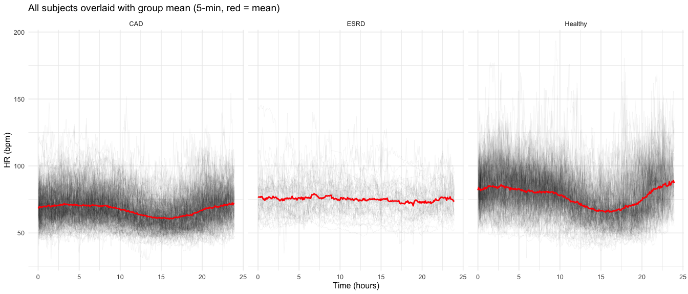
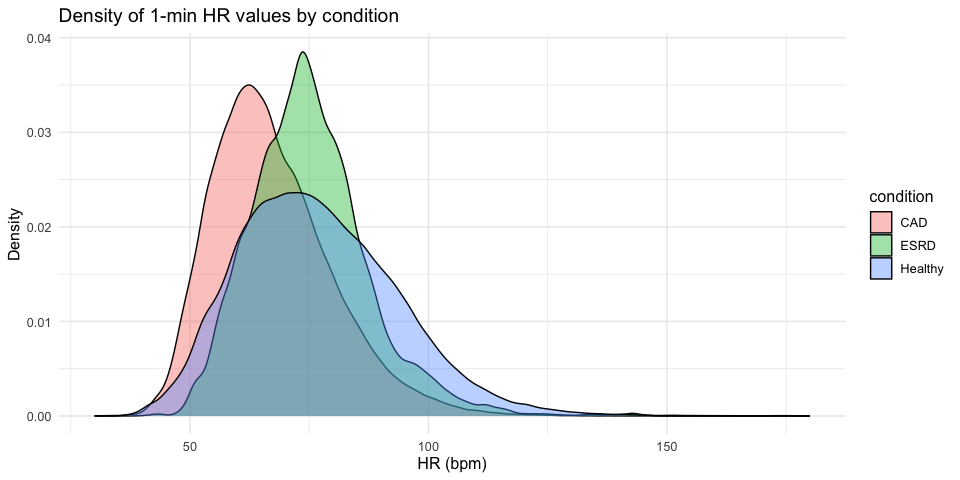
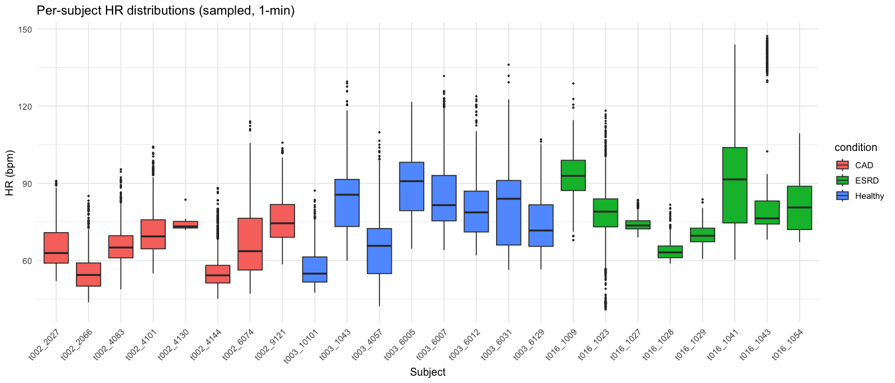
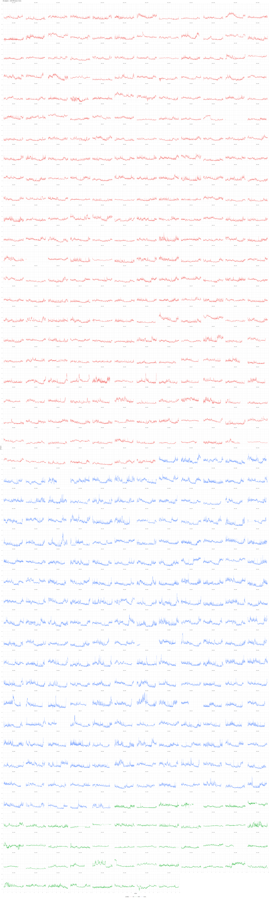

# EDA: THEW HR Time Series

2026-02-27

- [1 Setup & Data Loading](#1-setup--data-loading)
- [2 Subject-Level Summary](#2-subject-level-summary)
  - [Counts by Condition and Dataset](#counts-by-condition-and-dataset)
  - [Processing Summary](#processing-summary)
  - [Recording Duration](#recording-duration)
- [3 Missing Data Audit](#3-missing-data-audit)
  - [NA and Invalid Rows](#na-and-invalid-rows)
  - [Missingness by Condition](#missingness-by-condition)
- [4 Descriptive Statistics](#4-descriptive-statistics)
  - [Overall](#overall)
  - [Per-Subject](#per-subject)
  - [By Condition](#by-condition)
  - [Sanity Checks](#sanity-checks)
- [5 HR Time Series Plots (1-min)](#5-hr-time-series-plots-1-min)
  - [Individual Traces (Sampled)](#individual-traces-sampled)
  - [Spaghetti Plots by Condition](#spaghetti-plots-by-condition)
- [6 HR Time Series Plots (5-min)](#6-hr-time-series-plots-5-min)
  - [Individual Traces (Sampled)](#individual-traces-sampled-1)
  - [Spaghetti Plots by Condition](#spaghetti-plots-by-condition-1)
- [7 Distribution Plots](#7-distribution-plots)
  - [Density of All HR Values (1-min)](#density-of-all-hr-values-1-min)
  - [Per-Subject Boxplots (Sampled)](#per-subject-boxplots-sampled)
- [8 Full Subject Gallery](#8-full-subject-gallery)

## 1 Setup & Data Loading

    Processing summary loaded: 524 records

    --- 1-minute data ---

    Dimensions: 754560 rows x 16 cols

    Subjects: 524 

    Conditions: CAD, Healthy, ESRD 

    --- 5-minute data ---

    Dimensions: 150912 rows x 16 cols

    Subjects: 524 

    Rows: 754,560
    Columns: 16
    $ id              <chr> "t002_10003", "t002_10003", "t002_10003", "t002_10003"…
    $ orig_id         <dbl> 10003, 10003, 10003, 10003, 10003, 10003, 10003, 10003…
    $ dataset         <chr> "t002", "t002", "t002", "t002", "t002", "t002", "t002"…
    $ condition       <chr> "CAD", "CAD", "CAD", "CAD", "CAD", "CAD", "CAD", "CAD"…
    $ t               <dbl> 0, 1, 2, 3, 4, 5, 6, 7, 8, 9, 10, 11, 12, 13, 14, 15, …
    $ avg_hr          <dbl> NA, NA, NA, NA, NA, 72.27, 71.82, 68.88, 68.93, 69.36,…
    $ median_hr       <dbl> NA, NA, NA, NA, NA, 73.17, 72.07, 69.36, 68.97, 69.36,…
    $ sd_hr           <dbl> NA, NA, NA, NA, NA, 4.71, 2.59, 6.13, 2.70, 1.92, 1.94…
    $ sdnn_ms         <dbl> NA, NA, NA, NA, NA, 97.71, 30.19, 141.57, 34.47, 24.08…
    $ rmssd_ms        <dbl> NA, NA, NA, NA, NA, 138.13, 30.12, 206.21, 52.97, 29.2…
    $ beat_count      <dbl> 0, 0, 0, 0, 0, 71, 72, 68, 68, 70, 69, 72, 68, 69, 70,…
    $ valid           <lgl> FALSE, FALSE, FALSE, FALSE, FALSE, TRUE, TRUE, TRUE, T…
    $ recording_hours <dbl> 23.08, 23.08, 23.08, 23.08, 23.08, 23.08, 23.08, 23.08…
    $ used_last_24h   <lgl> FALSE, FALSE, FALSE, FALSE, FALSE, FALSE, FALSE, FALSE…
    $ minute          <dbl> 0, 1, 2, 3, 4, 5, 6, 7, 8, 9, 10, 11, 12, 13, 14, 15, …
    $ time_start_sec  <dbl> 0, 60, 120, 180, 240, 300, 360, 420, 480, 540, 600, 66…

## 2 Subject-Level Summary

### Counts by Condition and Dataset

| condition | dataset | n_subjects |
|:----------|:--------|-----------:|
| CAD       | t002    |        271 |
| ESRD      | t016    |         51 |
| Healthy   | t003    |        202 |

Subjects by condition and source dataset

| condition | n_subjects |
|:----------|-----------:|
| CAD       |        271 |
| ESRD      |         51 |
| Healthy   |        202 |

Total subjects by condition

### Processing Summary

| condition | n_subjects | mean_duration_hr | mean_valid_min | mean_hr_overall | n_success |
|:---|---:|---:|---:|---:|---:|
| CAD | 271 | 23.3 | 1392.6 | 67.2 | 271 |
| ESRD | 51 | 42.0 | 2461.8 | 75.8 | 51 |
| Healthy | 202 | 22.7 | 1351.0 | 76.9 | 202 |

Processing summary by condition

### Recording Duration

| condition | n_subjects | median_minutes | min_minutes | max_minutes | median_valid_min |
|:----------|-----------:|---------------:|------------:|------------:|-----------------:|
| CAD       |        271 |           1440 |        1440 |        1440 |             1438 |
| ESRD      |         51 |           1440 |        1440 |        1440 |             1438 |
| Healthy   |        202 |           1440 |        1440 |        1440 |             1395 |

Recording duration by condition

## 3 Missing Data Audit

### NA and Invalid Rows

| subjects_any_missing | subjects_gt5pct | subjects_gt20pct | median_pct_missing | max_pct_missing |
|---:|---:|---:|---:|---:|
| 500 | 132 | 21 | 0.9 | 98.7 |

Missing data summary (NA or invalid)

### Missingness by Condition

| condition | n_subjects | median_pct_missing | mean_pct_invalid | max_pct_missing |
|:----------|-----------:|-------------------:|-----------------:|----------------:|
| CAD       |        271 |                0.1 |              3.3 |            98.7 |
| ESRD      |         51 |                0.1 |              6.9 |            60.1 |
| Healthy   |        202 |                3.1 |              6.2 |            84.0 |

Missingness by condition

## 4 Descriptive Statistics

### Overall

|  n_obs | mean_hr | sd_hr | median_hr | iqr_hr | min_hr | max_hr |
|-------:|--------:|------:|----------:|-------:|-------:|-------:|
| 718451 |    71.6 |    15 |      69.7 |   19.7 |   29.4 |  199.9 |

Overall HR descriptive statistics (1-min, valid only)

### Per-Subject

| id         | condition | dataset | mean_hr | sd_hr | min_hr | max_hr | n_valid |
|:-----------|:----------|:--------|--------:|------:|-------:|-------:|--------:|
| t002_10003 | CAD       | t002    |    65.4 |   8.0 |   46.0 |  100.0 |    1367 |
| t002_10005 | CAD       | t002    |    50.2 |   6.7 |   40.1 |   82.8 |    1404 |
| t002_10008 | CAD       | t002    |    69.5 |   6.9 |   50.9 |   94.2 |    1385 |
| t002_10009 | CAD       | t002    |    65.7 |   8.9 |   51.7 |   94.3 |    1439 |
| t002_10014 | CAD       | t002    |    58.4 |  10.3 |   45.3 |   94.7 |    1395 |
| t002_10016 | CAD       | t002    |    62.9 |   7.2 |   46.0 |   93.4 |    1402 |
| t002_10017 | CAD       | t002    |    75.2 |  12.6 |   55.5 |  112.0 |    1439 |
| t002_10018 | CAD       | t002    |    50.9 |   4.0 |   43.2 |   75.0 |    1438 |
| t002_1002  | CAD       | t002    |    55.6 |   3.8 |   48.0 |   71.4 |    1344 |
| t002_10020 | CAD       | t002    |    60.6 |   6.0 |   50.6 |   86.2 |    1430 |
| t002_10021 | CAD       | t002    |    80.8 |  16.1 |   56.5 |  122.7 |    1438 |
| t002_10025 | CAD       | t002    |    67.2 |   5.8 |   56.6 |   88.0 |    1430 |
| t002_10026 | CAD       | t002    |    48.6 |   5.4 |   29.4 |   73.6 |    1430 |
| t002_10027 | CAD       | t002    |    69.2 |   9.6 |   47.3 |  108.1 |    1340 |
| t002_1003  | CAD       | t002    |    89.0 |  13.3 |   62.5 |  120.2 |    1437 |
| t002_10030 | CAD       | t002    |    65.5 |   9.1 |   41.0 |   94.0 |    1439 |
| t002_10033 | CAD       | t002    |    59.3 |   5.6 |   48.2 |   83.4 |    1439 |
| t002_10037 | CAD       | t002    |    59.7 |   9.4 |   45.4 |   96.0 |    1439 |
| t002_10038 | CAD       | t002    |    76.8 |   9.7 |   61.7 |  126.4 |    1439 |
| t002_10039 | CAD       | t002    |    65.1 |   5.5 |   54.9 |   85.0 |    1426 |

Per-subject stats (first 20)

### By Condition

### Sanity Checks

    Subjects with mean HR outside [40, 150] bpm: 0 

    Subjects with <12 hours valid data: 9 

    Individual minutes with HR outside [20, 250] bpm: 0 

| id         | condition | dataset | n_valid | mean_hr |
|:-----------|:----------|:--------|--------:|--------:|
| t002_2063  | CAD       | t002    |      19 |    58.0 |
| t002_4130  | CAD       | t002    |      19 |    74.1 |
| t003_10060 | Healthy   | t003    |     610 |    84.8 |
| t003_6004  | Healthy   | t003    |     230 |    63.3 |
| t003_6098  | Healthy   | t003    |     537 |    92.6 |
| t003_6115  | Healthy   | t003    |     610 |    85.0 |
| t016_1005  | ESRD      | t016    |     575 |    83.6 |
| t016_1015  | ESRD      | t016    |     672 |    88.2 |
| t016_1034  | ESRD      | t016    |     605 |    77.4 |

Subjects with \<12h valid data (first 20)

## 5 HR Time Series Plots (1-min)

### Individual Traces (Sampled)

### Spaghetti Plots by Condition

## 6 HR Time Series Plots (5-min)

### Individual Traces (Sampled)

### Spaghetti Plots by Condition

## 7 Distribution Plots

### Density of All HR Values (1-min)

### Per-Subject Boxplots (Sampled)

## 8 Full Subject Gallery

Every subject’s 1-min HR trace, faceted by ID and colored by condition.

